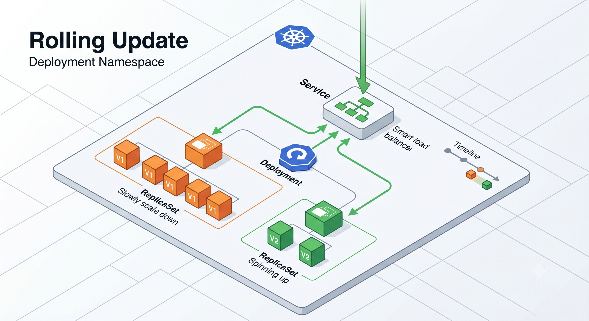
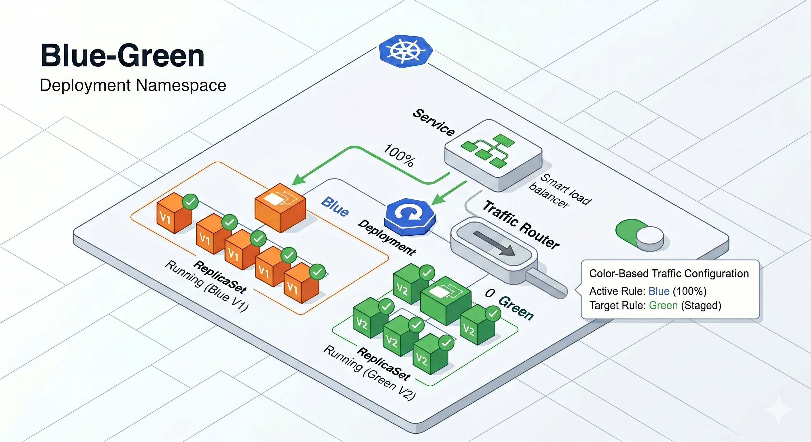
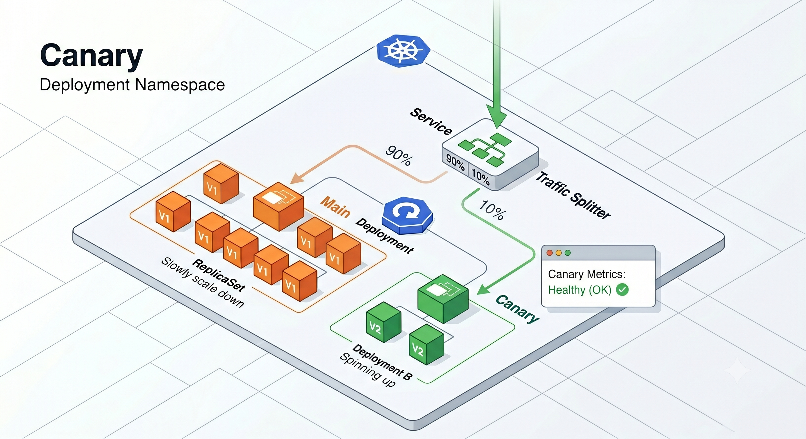

# TaskFlow: Kubernetes & Observability Guide

Welcome to the TaskFlow Kubernetes and Observability curriculum! This project serves as a comprehensive bridge from Docker basics to production-grade Kubernetes, complete with a modern three-pillar observability stack (Prometheus, Loki, Tempo, Grafana).

## 📚 The Curriculum

The documentation has been structured into a 13-part curriculum. Each chapter contains theoretical explanations, references to the exact code in this project, and hands-on KubeCtl/Grafana challenges.

*We recommend reading them in order:*

### Phase 1: Core Kubernetes
1. [00 — Introduction: Docker → Kubernetes](./docs/00-introduction.md)
2. [01 — Core Workloads: Pods, Deployments, StatefulSets](./docs/01-core-workloads.md)
3. [02 — Networking: Services, Ingress, and DNS](./docs/02-networking.md)
4. [03 — Configuration: ConfigMaps and Secrets](./docs/03-configuration.md)
5. [04 — Storage: PV, PVC, and StorageClass](./docs/04-storage.md)

### Phase 2: Helm & CI/CD
6. [05 — Helm: The Package Manager for Kubernetes](./docs/05-helm.md)
7. [06 — CI/CD: Automated Deployments](./docs/06-cicd.md)

### Phase 3: Reliability & Observability Architecture
8. [07 — Reliability: HPA, PDB, Resource Limits](./docs/07-reliability.md)
9. [08 — Observability Architecture: The Three Pillars](./docs/08-observability-arch.md)

### Phase 4: Load Testing & Telemetry
10. [09 — Load Testing: Validating Autoscaling](./docs/09-load-testing.md)
11. [10 — Metrics: Prometheus and PromQL](./docs/10-metrics.md)
12. [11 — Logging: Loki, Promtail, and LogQL](./docs/11-logging.md)
13. [12 — Distributed Tracing: OpenTelemetry and Tempo](./docs/12-tracing.md)

### Phase 5: Deployment Strategies
14. [13 — Deployment Strategies: Rolling Update, Blue-Green & Canary](./docs/13-deployment-strategies.md)

---

### ⚡ Advanced Topics (Within Chapters)

The following deep-dive sections are embedded within their respective chapters for learners who want to go beyond the basics:

| Topic | Where to Find It |
|-------|-----------------|
| How the Control Plane orchestrates a workload (API Server → etcd → Scheduler → Kubelet → kube-proxy, step-by-step) | [00 — Introduction §Control Plane Orchestration](./docs/00-introduction.md) |
| Advanced Namespace strategies: env-per-namespace, team-per-namespace, ResourceQuota, kubens | [00 — Introduction §Advanced Namespace Strategies](./docs/00-introduction.md) |
| StatefulSet deep dive: sticky identities, PV reattachment, Headless Service DNS, production database guidance | [01 — Core Workloads §Why StatefulSets Are Fundamentally Different](./docs/01-core-workloads.md) |
| Cloud vs Bare-Metal Ingress architecture, Default Backend configuration | [02 — Networking §Cloud vs. Bare-Metal](./docs/02-networking.md) |
| Helm as a Templating Engine: DRY pattern, environment promotion, CI/CD injection, Helm Registries | [05 — Helm §Helm as a Templating Engine](./docs/05-helm.md) |

---

## 🏗️ Project Architecture Overview

This project runs the TaskFlow API (Node.js/Express) and Web UI (React) backed by MongoDB. The entire stack is instrumented for metrics, logs, and traces.


*For a deep dive into how every component above communicates, see [08 — Observability Architecture](./docs/08-observability-arch.md).*

---

## 🚀 Quick Start Guide

### Prerequisites
1. [Docker](https://docs.docker.com/get-docker/) installed and running.
2. [Minikube](https://minikube.sigs.k8s.io/docs/start/) installed.
3. [Helm](https://helm.sh/docs/intro/install/) installed.

### 1. Start Cluster & Enable Addons
```bash
minikube start --cpus=4 --memory=6144
minikube addons enable ingress
minikube addons enable metrics-server
```

### 2. Install the Observability Stack (Kube-Prometheus + Loki + Tempo)
```bash
# Add Helm repositories
helm repo add prometheus-community https://prometheus-community.github.io/helm-charts
helm repo add grafana https://grafana.github.io/helm-charts
helm repo update

# 1. Install Prometheus & Grafana
helm install monitoring prometheus-community/kube-prometheus-stack --namespace monitoring --create-namespace

# 2. Install Loki (Logs)
helm install loki grafana/loki-stack --namespace monitoring --set grafana.enabled=false

# 3. Install Tempo (Traces)
helm install tempo grafana/tempo --namespace monitoring
```

### 3. Deploy the TaskFlow Application
The entire application is packaged as a single Helm chart.
```bash
helm upgrade --install taskflow ./helm/taskflow \
  --namespace taskflow \
  --create-namespace \
  --set api.env.jwtSecret="dev-secret-key-123" \
  --set api.env.otelEnabled="true"
```

### 4. Setup Local DNS (Hosts file)
Map the Minikube IP to our custom domains:
```bash
echo "$(minikube ip) taskflow.local grafana.local" | sudo tee -a /etc/hosts
# Windows: Edit C:\Windows\System32\drivers\etc\hosts manually
```

### 5. Access the Interfaces
- **TaskFlow App:** `http://taskflow.local`
- **Grafana:** `http://grafana.local` (or `kubectl port-forward svc/monitoring-grafana -n monitoring 8080:80`)
  - Username: `admin`
  - Password: `prom-operator`

---

## 🛠️ Essential Cheatsheet

### Helm Operations
```bash
helm list -A                                    # List all deployments
helm upgrade taskflow ./helm/taskflow ...       # Apply changes
helm template taskflow ./helm/taskflow          # Dry run (view YAML)
helm uninstall taskflow -n taskflow             # Tear down the app
```

### Pods & Troubleshooting
```bash
kubectl get pods -n taskflow -w                 # Watch pods spin up live
kubectl describe pod <pod-name> -n taskflow     # Find out WHY a pod is failing
kubectl logs <pod-name> -n taskflow             # View standard output logs
kubectl exec -it <pod-name> -n taskflow -- sh   # Shell into a running container
```

### Autoscaling (HPA) & Services
```bash
kubectl get hpa -n taskflow -w                  # Watch autoscaler CPU% live
kubectl top pods -n taskflow                    # Check actual RAM/CPU usage
kubectl get svc,ingress -n taskflow             # View networking rules
```

### Dashboard Imports
To load the custom dashboards in Grafana (`Dashboards -> Import`):
- Metrics & Health: [`monitoring/taskflow-dashboard-import.json`](./monitoring/taskflow-dashboard-import.json)
- Centralized Logs: [`monitoring/log-dashboard.json`](./monitoring/log-dashboard.json)

---

## 📁 Raw YAML vs Helm Templates

If you are learning Kubernetes for the first time, Helm's templating (`{{ .Values... }}`) can be confusing. 

To bridge this gap, the curriculum chapters (such as `01-core-workloads.md`) include a **Raw YAML Reference** section at the bottom. These explain the pure, un-templated Kubernetes configurations found in the [`k8s-scripts/`](./k8s-scripts/) folder.

Read the raw YAML in `k8s-scripts/` and the explanations in the curriculum first to understand *what* Kubernetes wants, then look at `helm/taskflow/templates/` to understand *how* Helm generates it.

Happy scaling!

---

## 🚢 Deployment Strategies

This project includes three production-grade deployment strategies implemented as dedicated Helm charts. Understanding these strategies is the key to shipping new versions safely.

> **Full learning guide:** [13 — Deployment Strategies: Rolling Update, Blue-Green & Canary](./docs/13-deployment-strategies.md)

---

### 🔄 Rolling Update — The Safe Default

Kubernetes's built-in default. Pods are replaced **one at a time**, gated by the readiness probe. Old pods keep serving traffic until the new pod is healthy. Zero additional infrastructure required.



*V1 pods (orange, slowly scaling down) and V2 pods (green, spinning up) co-exist during the transition. The smart load balancer only routes to pods that pass the readiness probe.*

**Helm chart:** `helm/taskflow/` — every Deployment uses `strategy.type: RollingUpdate` with `maxSurge: 1` and `maxUnavailable: 0`.

```bash
# Trigger a rolling update
kubectl rollout restart deployment/taskflow-api -n taskflow
kubectl rollout status deployment/taskflow-api -n taskflow

# Roll back instantly if something goes wrong
kubectl rollout undo deployment/taskflow-api -n taskflow
```

| ✅ Best for | ❌ Avoid when |
|---|---|
| Everyday feature releases | Versions are API-incompatible |
| Simple, low-risk upgrades | You need instant cutover |
| Resource-constrained clusters | You need A/B traffic splitting |

---

### 🔵🟢 Blue-Green — Instant, Atomic Cutover

Two complete, identical environments run simultaneously. The Service selector points to exactly **one** at a time. Flip it and 100% of traffic moves in an instant — no partial state, no gradual rollout.



*Blue (V1) serves 100% of live traffic. Green (V2) is fully deployed and tested in isolation. A single selector change (the toggle on the right) flips all traffic to Green — or back to Blue in an emergency.*

**Helm chart:** `helm/blue-green/` — controlled by the `productionTarget` value in `values.yaml`.

```bash
# Deploy both colours (green gets no traffic yet)
helm upgrade --install taskflow ./helm/blue-green -n taskflow

# Test green privately before anyone sees it
kubectl port-forward deployment/taskflow-web-green 8080:80 -n taskflow

# Instant cutover to green
helm upgrade taskflow ./helm/blue-green -n taskflow \
  --set web.productionTarget=green

# Instant rollback to blue
helm upgrade taskflow ./helm/blue-green -n taskflow \
  --set web.productionTarget=blue
```

| ✅ Best for | ❌ Avoid when |
|---|---|
| Critical, zero-risk releases | Resources are constrained (needs 2x) |
| Scheduled maintenance windows | Breaking DB schema changes |
| When sub-second rollback is required | Long-running idle environments are costly |

---

### 🐤 Canary — Gradual, Data-Driven Promotion

Release to a **small percentage of real users first** (e.g., 10%), monitor error rates and latency in Grafana, and gradually increase the percentage only when metrics are green. Implemented using NGINX Ingress `canary-weight` annotations — no service mesh needed.



*The Traffic Splitter routes 90% to the stable V1 Deployment and 10% to the Canary V2 Deployment. The "Canary Metrics: Healthy" panel in the corner represents what you watch in Grafana before promoting further.*

**Helm chart:** `helm/canary/` — controlled by `api.deployments.canary.weight` in `values.yaml`.

```bash
# Deploy with 10% canary traffic
helm upgrade --install taskflow ./helm/canary -n taskflow \
  --set api.deployments.canary.weight=10

# Monitor in Grafana, then promote gradually
helm upgrade taskflow ./helm/canary -n taskflow \
  --set api.deployments.canary.weight=30
helm upgrade taskflow ./helm/canary -n taskflow \
  --set api.deployments.canary.weight=50

# Emergency rollback — drop canary to zero instantly
helm upgrade taskflow ./helm/canary -n taskflow \
  --set api.deployments.canary.weight=0
```

| ✅ Best for | ❌ Avoid when |
|---|---|
| High-stakes, complex changes | API versions are incompatible |
| A/B testing new features | You lack observability (no Grafana/Prometheus) |
| Performance-sensitive rollouts | Exact traffic percentages are required |

---

### Strategy Selection Guide

| Scenario | Recommended Strategy |
|---|---|
| Daily CI/CD pipeline release | **Rolling Update** |
| Scheduled "big bang" release with instant rollback | **Blue-Green** |
| Risky change, want real traffic validation | **Canary** |
| Both versions incompatible (schema change) | **Blue-Green** + DB migration |
| A/B test (measure user behaviour) | **Canary** |

For the full deep-dive with hands-on kubectl challenges, see [Chapter 13 — Deployment Strategies](./docs/13-deployment-strategies.md).
