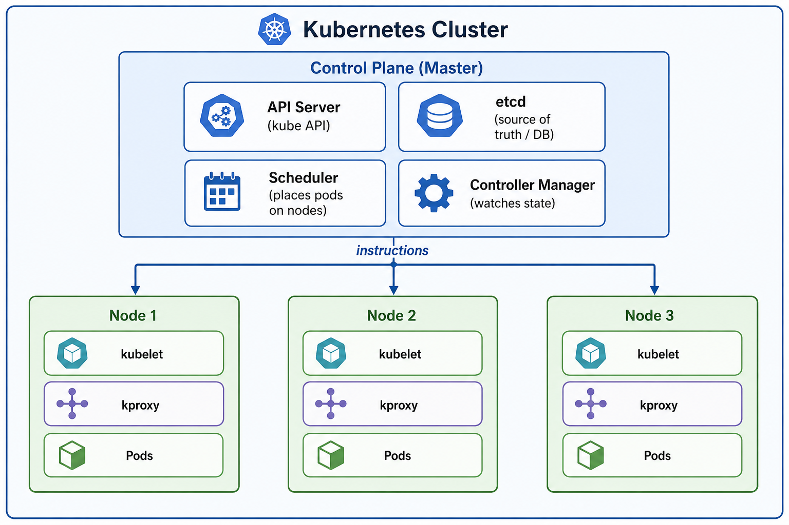
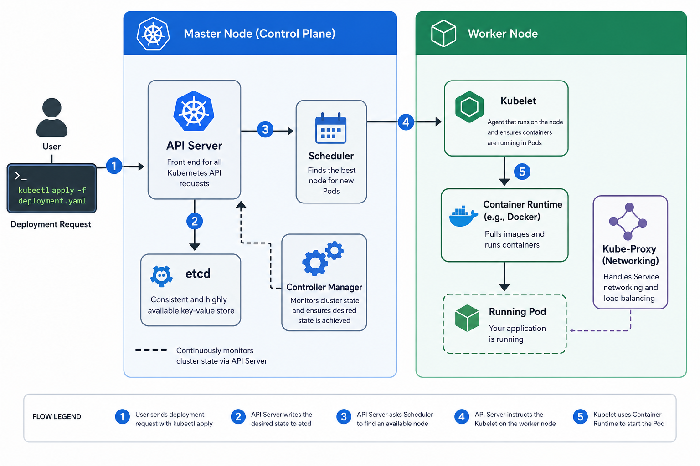

# 00 — Introduction: Docker → Kubernetes

> **Audience:** You know Docker. You can build images, write `docker-compose.yml`, and run containers. Now you want to understand Kubernetes.

---

## 🧠 Theory: From Docker to Kubernetes

### What Docker Gives You

Docker solves the "works on my machine" problem. You package your app + its dependencies into an **image**. That image runs identically anywhere Docker is installed.

```
Your code + Node.js 20 + all npm packages
         ↓ docker build
Image: ghcr.io/senghaniheet/taskflow-api:latest
         ↓ docker run
Container running on port 5000
```

### What Docker Doesn't Solve

| Problem | Docker's Answer | Reality |
|---------|----------------|---------|
| What if the container crashes? | Restart policy | Manual; fragile in production |
| How do I run 10 copies for traffic? | `docker-compose --scale` | Not production-grade |
| How do containers find each other across servers? | Custom networks | Breaks across machines |
| How do I update my app with zero downtime? | You don't, easily | Rolling updates are manual |
| What happens when a server dies? | Your container dies with it | No failover |

Kubernetes solves all of these — automatically.

### The Key Mental Shift

With Docker you say: **"Run this container."**

With Kubernetes you say: **"I want 3 healthy instances of this app running, always."**

Kubernetes figures out *how* to make that true. If a server dies, it reschedules the container elsewhere. If the container crashes, it restarts it. You declare the **desired state** and Kubernetes maintains it forever.

---

## 🏗️ Cluster Anatomy

A Kubernetes cluster has two types of machines: the **Control Plane** that makes decisions, and **Worker Nodes** that run your workloads.



**Reading this diagram from top to bottom:**

The **Control Plane (Master)** is the brain of the cluster. You never run your application here — it exists purely to manage the workers. It has four components:

- **API Server** — every action (kubectl apply, helm install, pod creation) goes through here first. It's a REST API that validates your YAML and writes it to etcd.
- **etcd** — a distributed key-value store that is the single source of truth. It stores *every* resource definition in the cluster. If etcd is lost, the cluster is lost.
- **Scheduler** — watches for pods with no assigned node and picks the best node based on available resources and affinity rules.
- **Controller Manager** — a control loop. It continuously compares *current state* vs *desired state*. If you asked for 3 API replicas and one dies, the Controller Manager notices and tells the Scheduler to create a new one.

The **arrow labelled "instructions"** represents the API Server pushing pod specifications down to each node's Kubelet.

Each **Worker Node** runs three things:

- **kubelet** — the local agent. It receives pod specs from the API Server and instructs the container runtime (containerd) to start/stop containers. It also reports node health back up.
- **kproxy** (kube-proxy) — manages the iptables/IPVS rules that make Services work. When you call `mongo:27017` from the API pod, kube-proxy is the reason traffic lands on the right pod.
- **Pods** — your actual workloads. Multiple pods run on each node, depending on how much CPU/memory each pod requests.

> **In Minikube:** all four Control Plane components AND your worker pods share the same single VM. This is fine for learning but means resource contention if you over-deploy.

### Control Plane Components

| Component | Role | Analogy |
|-----------|------|---------|
| **API Server** | The front door. All `kubectl` commands talk to it. Validates, authenticates, and persists every request. | Reception desk + security guard |
| **etcd** | A distributed key-value store. The cluster's single source of truth. Every resource you create is stored here as JSON. | The database |
| **Scheduler** | Decides which Node a new Pod should run on (based on available CPU/RAM, node affinity, taints/tolerations). | Dispatcher |
| **Controller Manager** | Watches actual vs desired state. If you asked for 3 replicas and one dies, it triggers creation of a new one. | The enforcer |

### Worker Node Components

| Component | Role |
|-----------|------|
| **Kubelet** | Agent on every node. Receives pod specs from the API Server and instructs the container runtime to start/stop containers. Reports node and pod health back up. |
| **kube-proxy** | Runs on every node. Manages the `iptables`/IPVS rules that make Services work. When you call `api:5000` from a pod, kube-proxy is what ensures the packet is forwarded to the correct destination pod with minimal network overhead — without the traffic ever leaving the node if the target pod is local. |
| **Container Runtime** | Actually runs containers (containerd, CRI-O). Docker is not used in modern K8s. |

---

## 🔄 How the Control Plane Orchestrates a Workload

Understanding the exact sequence of events from `kubectl apply` to a running pod clarifies how all four control plane components and kube-proxy work together.



> [!NOTE]
> **Why "API Server as gatekeeper"?** Every single piece of communication — from `kubectl`, from the Scheduler, from the Kubelet, from the Controller Manager — goes *through* the API Server. No component talks to etcd directly. No component talks to another component directly. The API Server is the single, enforced choke point for authentication, authorization, and validation.


---

## Namespaces — Virtual Clusters

A Namespace is a logical partition inside a cluster. Think of it like folders: resources in different namespaces are isolated from each other.

```
taskflow      → the application (API, Web, MongoDB)
monitoring    → observability stack (Prometheus, Grafana, Loki, Tempo)
ingress-nginx → the Nginx Ingress Controller
kube-system   → Kubernetes internal components
```

**Raw YAML** ([k8s-scripts/00-namespace.yaml](../k8s-scripts/00-namespace.yaml)):
```yaml
apiVersion: v1
kind: Namespace
metadata:
  name: taskflow
  labels:
    # key=value pairs used for grouping and filtering resources
    app.kubernetes.io/managed-by: helm
    environment: production
```

### Advanced Namespace Strategies

Namespaces are more than just organization — they are the primary tool for **multi-tenancy**, **environment isolation**, and **resource governance** in enterprise clusters.

#### Strategy 1: Environment-per-Namespace (Most Common)

Run staging and production in the same cluster, sharing expensive infrastructure (Ingress Controller, monitoring stack) while keeping application workloads separate:

```
Same cluster:
  taskflow-prod     → 3 API replicas, 3 web replicas (production traffic)
  taskflow-staging  → 1 API replica, 1 web replica (CI/CD deploys here first)
  monitoring        → shared Prometheus + Grafana (scrapes both namespaces)
  ingress-nginx     → shared Ingress Controller (routes by hostname)
```

With Helm, deploying to staging is a single command:
```bash
helm upgrade --install taskflow-staging ./helm/taskflow \
  --namespace taskflow-staging --create-namespace \
  --values helm/taskflow/values-staging.yaml
```

#### Strategy 2: Team-per-Namespace

In larger organizations, each team owns a namespace and has scoped RBAC (Role-Based Access Control) — developers can deploy to their namespace but cannot touch another team's resources:

```
  team-payments      → payments team's services
  team-auth          → authentication team's services
  team-notifications → notifications team's services
```

#### Resource Quotas: Preventing Noisy Neighbours

Without limits, one misbehaving team or runaway HPA can consume all cluster CPU/RAM. A **ResourceQuota** enforces hard caps per namespace:

```yaml
# k8s-scripts/00-resource-quota.yaml
apiVersion: v1
kind: ResourceQuota
metadata:
  name: taskflow-quota
  namespace: taskflow
spec:
  hard:
    # Pod count limits
    pods: "20"                    # Maximum 20 pods total in this namespace
    # Compute limits
    requests.cpu: "4"             # Total CPU requests across all pods ≤ 4 cores
    requests.memory: 8Gi          # Total memory requests ≤ 8 GiB
    limits.cpu: "8"               # Total CPU limits ≤ 8 cores
    limits.memory: 16Gi           # Total memory limits ≤ 16 GiB
    # Storage limits
    persistentvolumeclaims: "5"   # Max 5 PVCs
    requests.storage: 20Gi        # Total storage across all PVCs ≤ 20 GiB
```

```bash
# Apply and inspect quota usage
kubectl apply -f k8s-scripts/00-resource-quota.yaml
kubectl describe resourcequota taskflow-quota -n taskflow
# Shows: Used vs Hard limits — instantly see how much headroom you have
```

> [!NOTE]
> **LimitRange** is the companion to ResourceQuota. While ResourceQuota sets namespace-wide totals, a LimitRange sets **per-container** default limits — so any pod deployed without explicit resource requests automatically gets sensible defaults rather than running uncapped.

#### Tooling: kubens — Switch Namespaces Instantly

Typing `-n taskflow` on every `kubectl` command gets old fast. The [`kubens`](https://github.com/ahmetb/kubectx) tool lets you set a default namespace for your session:

```bash
# Install (via kubectx package which includes kubens)
# Windows (Chocolatey)
choco install kubectx

# macOS
brew install kubectx

# Usage
kubens                    # List all namespaces
kubens taskflow           # Switch default to taskflow
kubectl get pods          # Now targets taskflow without -n flag
kubens monitoring         # Switch to monitoring
kubectl get pods          # Targets monitoring namespace
```

Paired with [`kubectx`](https://github.com/ahmetb/kubectx) (which switches between clusters), these two tools are standard in every Kubernetes engineer's toolkit.

---

## ⌨️ kubectl Essentials

`kubectl` is your CLI for talking to the Kubernetes API Server.

### Contexts & Namespaces

```bash
# Which cluster am I connected to?
kubectl config current-context

# Switch cluster
kubectl config use-context minikube

# Work in a specific namespace (so you don't have to type -n every time)
kubectl config set-context --current --namespace=taskflow
```

### The Core Commands

```bash
# List resources
kubectl get pods -n taskflow
kubectl get pods -n taskflow -w              # -w = watch mode (live updates)
kubectl get pods -n taskflow -o wide         # Show node assignment + IP
kubectl get all -n taskflow                  # Pods, Services, Deployments...

# Inspect a resource (extremely useful for debugging)
kubectl describe pod <pod-name> -n taskflow  # Events section shows WHY it's failing

# Logs
kubectl logs <pod-name> -n taskflow          # Last run's logs
kubectl logs <pod-name> -n taskflow -f       # Follow/tail live
kubectl logs <pod-name> -n taskflow --previous  # Logs from crashed previous container

# Execute into a running container
kubectl exec -it <pod-name> -n taskflow -- sh
kubectl exec -it <pod-name> -n taskflow -- env | grep MONGO  # Check env vars

# Apply / Delete YAML
kubectl apply -f my-file.yaml
kubectl delete -f my-file.yaml
kubectl delete pod <pod-name> -n taskflow    # Force restart a single pod

# Restart all pods (triggers rolling update)
kubectl rollout restart deployment/taskflow-api -n taskflow
kubectl rollout status deployment/taskflow-api -n taskflow
```

---

## 🖥️ Minikube: Local K8s Cluster

Minikube runs a **single-node** Kubernetes cluster inside a VM or container on your laptop.

### How It Differs from Production

| Aspect | Minikube | Production (GKE/EKS) |
|--------|----------|----------------------|
| Nodes | 1 | 3–100+ |
| Control Plane | Shared with worker | Managed, separate |
| Load Balancers | `minikube tunnel` or NodePort | Cloud LBs (ELB, GCLB) |
| Storage | hostPath on local disk | Managed disks (EBS, PD) |
| Image Registry | Load images locally | Container registries (GHCR, ECR) |

### Minikube Commands

```bash
minikube start --cpus=4 --memory=6144   # Start with enough resources
minikube status                          # Check if it's running
minikube ip                              # Get the cluster IP (for /etc/hosts)
minikube ssh                             # SSH into the Minikube VM
minikube addons enable ingress           # Enable Nginx Ingress Controller
minikube addons enable metrics-server    # Required for HPA
minikube image load <image>              # Load a local Docker image (skip registry)
minikube stop                            # Stop without destroying
minikube delete                          # Destroy the cluster
```

---

## 🛠️ Hands-On Challenge

**Goal:** Start Minikube and explore the cluster.

```bash
# 1. Start Minikube
minikube start --cpus=4 --memory=6144

# 2. Explore the cluster nodes
kubectl get nodes
kubectl describe node minikube          # Read the Capacity, Allocatable, and Events sections

# 3. Look at the system namespaces that K8s creates itself
kubectl get namespaces
kubectl get pods -n kube-system         # K8s internal components running as pods!

# 4. See the control plane components running as pods
kubectl get pods -n kube-system | grep -E "apiserver|etcd|scheduler|controller"

# 5. Look at your taskflow namespace (after deploying)
kubectl get all -n taskflow

# 6. Explore a running API pod
kubectl get pods -n taskflow
kubectl describe pod <api-pod-name> -n taskflow
# Look for: Node, Status, Containers, Conditions, Events
```

**What to notice:**
- The control plane runs as pods in `kube-system`
- Every pod has its own cluster IP (ephemeral, changes on restart)
- The `Events` section in `describe` tells you why a pod is failing (ImagePullBackOff, OOMKilled, etc.)

---

**Next:** [01 — Core Workloads: Pods, Deployments, StatefulSets →](./01-core-workloads.md)
