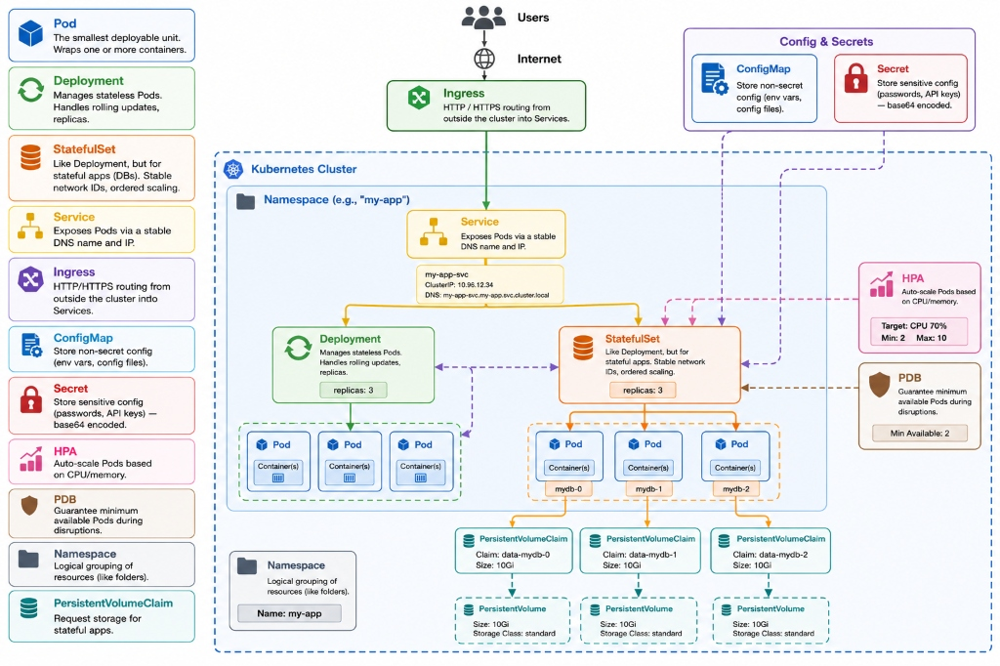

# 01 — Core Workloads: Pods, Deployments, StatefulSets

> **Prerequisites:** [00 — Introduction](./00-introduction.md)

---

## 🧠 Theory: The Workload Hierarchy

```
You interact with:   Deployment / StatefulSet / DaemonSet
                              ↓ manages
                         ReplicaSet
                              ↓ manages
                            Pods
                              ↓ contains
                          Container(s)
```

You almost never create Pods directly. You create a **Deployment** or **StatefulSet**, which manages Pods for you.

---

## Pod — The Atomic Unit

A Pod is the smallest deployable unit. It wraps **one or more containers** that:
- Share the same network interface (same IP, `localhost` is shared)
- Share the same storage volumes
- Are always scheduled on the same node

### Why Not Just Use Pods Directly?

```
You create a naked Pod: kubectl apply -f pod.yaml
Pod crashes.
Kubernetes does NOT recreate it.
Your app is down.
```

Pods are ephemeral by design. Every time a Pod is created, it gets a new IP address. Nothing in a Pod is guaranteed to persist.

**Use a Deployment instead.** Deployments guarantee your desired replica count is always running.

### Pod Lifecycle States

| State | Meaning |
|-------|---------|
| `Pending` | Pod accepted, but containers not started yet (waiting for node, image pull) |
| `Running` | At least one container is running |
| `Succeeded` | All containers completed successfully (Jobs only) |
| `Failed` | All containers exited, at least one with failure |
| `CrashLoopBackOff` | Container keeps crashing; K8s is backing off retries exponentially |
| `OOMKilled` | Container exceeded its memory limit and was killed |
| `ImagePullBackOff` | Cannot pull the container image (wrong tag, auth failure) |

---

## Deployment — Managing Stateless Replicas

A Deployment manages a set of identical, interchangeable Pods (stateless). It wraps a **ReplicaSet** which actually manages the Pods.

### Rolling Update: Zero-Downtime Deploys

This project uses `maxUnavailable: 0` and `maxSurge: 1`:

```
Initial state (3 pods running, all old version):
  [api-abc] [api-def] [api-ghi]   ← old pods

Step 1: Create 1 new pod (4 pods total):
  [api-abc] [api-def] [api-ghi]   ← old
  [api-xyz]                        ← new (starting...)

Step 2: New pod passes readiness probe:
  [api-abc] [api-def] [api-ghi]   ← old (serving)
  [api-xyz]                        ← new (serving)

Step 3: Kill 1 old pod (back to 3):
  [api-def] [api-ghi]             ← old
  [api-xyz]                        ← new

  ... repeat until all replaced ...

Final state (all new):
  [api-xyz] [api-uvw] [api-rst]   ← all new
```

**The readiness probe is the gatekeeper.** If the new pod fails the readiness probe, the rollout pauses — the old pods continue serving traffic. No downtime.

### Rollback

```bash
# See rollout history
kubectl rollout history deployment/taskflow-api -n taskflow

# Roll back to previous version
kubectl rollout undo deployment/taskflow-api -n taskflow

# Roll back to a specific revision
kubectl rollout undo deployment/taskflow-api -n taskflow --to-revision=2
```

---

## StatefulSet — For Stateful Applications (MongoDB)

StatefulSets are for applications that need:
- **Stable identity:** Pod names don't change (`mongo-0`, `mongo-1`)
- **Ordered deployment:** Start in order (0, 1, 2), stop in reverse (2, 1, 0)
- **Stable storage:** Each pod gets its own PVC that persists across restarts

### Deployment vs StatefulSet Side by Side

| Feature | Deployment (API, Web) | StatefulSet (MongoDB) |
|---------|----------------------|----------------------|
| Pod names | Random hash (`api-abc123`) | Ordered (`mongo-0`) |
| Pod DNS | Unstable IP | `mongo-0.mongo.taskflow.svc` |
| Start order | Simultaneous | Sequential |
| Storage | Shared or none | Unique PVC per pod |
| Scaling | Any order | Ordered |
| Use case | Stateless (HTTP servers) | Stateful (databases, queues) |

### Why MongoDB MUST Be a StatefulSet

MongoDB stores data in `/data/db`. When the pod restarts, it needs to find the same data it had before. With a Deployment, a new pod would get a fresh empty volume — the database would be empty. With a StatefulSet, `mongo-0` always gets the same PVC (and therefore the same data directory) regardless of how many times it restarts.

---

## Probes: The Traffic Gatekeeper

### Readiness Probe
Answers: **"Is this container ready to receive traffic?"**
- Until this passes, the Service will NOT route traffic to this pod
- Critical during startup and rolling updates
- If it fails after startup, the pod is temporarily removed from Service load balancing (not killed)

### Liveness Probe  
Answers: **"Is this container still alive?"**
- If this fails `failureThreshold` times in a row, the container is **killed and restarted**
- Catches deadlocks, infinite loops, and hung processes

```yaml
# From api-deployment.yaml — both probes hit the same /api/health endpoint
readinessProbe:
  httpGet:
    path: /api/health
    port: 5000
  initialDelaySeconds: 5    # Wait 5s before first check (app needs time to start)
  periodSeconds: 10         # Check every 10s
  failureThreshold: 5       # Remove from Service after 5 failures

livenessProbe:
  httpGet:
    path: /api/health
    port: 5000
  initialDelaySeconds: 15   # Longer delay — only check liveness after app is up
  periodSeconds: 15
  failureThreshold: 5       # Restart container after 5 failures
```

### What Happens Without Probes

1. Pod starts, container is still initialising (connecting to DB, warming up)
2. K8s assumes it's ready immediately
3. Traffic is routed to the pod
4. Users see errors while the app is still starting
5. **Result: downtime on every deploy**

---

## 🔍 In This Project

### API Deployment
**File:** [`helm/taskflow/templates/api-deployment.yaml`](../helm/taskflow/templates/api-deployment.yaml)

Key lines to understand:
```yaml
strategy:
  type: RollingUpdate
  rollingUpdate:
    maxSurge: 1          # ← one extra pod during update
    maxUnavailable: 0    # ← zero pods taken down before replacement is ready

annotations:
  checksum/config: {{ ... | sha256sum }}   # ← force restart when ConfigMap changes
  checksum/secret: {{ ... | sha256sum }}   # ← force restart when Secret changes
```

**Raw YAML version:** [`k8s-scripts/02-deployment.yaml`](../k8s-scripts/02-deployment.yaml)

### MongoDB StatefulSet
**File:** [`helm/taskflow/templates/mongo-statefulset.yaml`](../helm/taskflow/templates/mongo-statefulset.yaml)

```yaml
kind: StatefulSet
spec:
  serviceName: taskflow-mongo  # ← headless service for stable DNS
  replicas: 1
  template:
    spec:
      containers:
        - volumeMounts:
            - name: mongo-storage
              mountPath: /data/db  # ← MongoDB's data dir, must persist
      volumes:
        - persistentVolumeClaim:
            claimName: taskflow-mongo-pvc  # ← the durable storage
```

**Raw YAML version:** [`k8s-scripts/03-statefulset.yaml`](../k8s-scripts/03-statefulset.yaml)

---

## 🛠️ Hands-On Challenge

**Goal:** Observe rolling updates and StatefulSet behaviour live.

```bash
# ── Part 1: Watch a Rolling Update ─────────────────────────

# Terminal 1: Watch pods continuously
kubectl get pods -n taskflow -w

# Terminal 2: Trigger a rolling restart (simulates a new image deploy)
kubectl rollout restart deployment/taskflow-api -n taskflow

# In Terminal 1 you should see:
# - New pods created (Pending → Running)
# - Old pods terminated one by one
# - Never more than 1 old + 1 new pod missing simultaneously

# ── Part 2: Understand the StatefulSet ──────────────────────

# See the stable pod name
kubectl get pods -n taskflow | grep mongo
# Should always be: taskflow-mongo-0  (not a random hash)

# Delete the MongoDB pod (simulate a crash)
kubectl delete pod taskflow-mongo-0 -n taskflow

# Watch it restart — same name, same PVC, same data
kubectl get pods -n taskflow -w
# taskflow-mongo-0 will come back with the same name

# ── Part 3: Explore Probe Behaviour ─────────────────────────

# See probe configuration for the API
kubectl describe pod <api-pod-name> -n taskflow
# Look for: Liveness, Readiness sections

# Force a pod to be "not ready" — what happens?
kubectl exec -it <api-pod-name> -n taskflow -- sh
# Inside the pod:
kill 1  # Kill the main process
# Watch the pod restart (CrashLoopBackOff → Running)
```

**What to notice:**
- During rolling update: old pods are still serving traffic while new ones start
- StatefulSet pods always have ordinal names (mongo-0)
- After killing mongo-0, it comes back with the same name and all data intact

---

**Next:** [02 — Networking: Services, Ingress, and DNS →](./02-networking.md)


## Raw YAML Reference

Below is the annotated raw YAML equivalent of the workloads discussed in this chapter. This shows the exact Kubernetes API definitions before Helm templating.



### [00-namespace.yaml](../k8s-scripts/00-namespace.yaml) — Namespaces
**WHAT IS A NAMESPACE?**
A Namespace is a virtual cluster inside a physical cluster.
Think of it like folders on your computer:
  - `/home/user/work/`   → namespace: `production`
  - `/home/user/play/`   → namespace: `staging`

Resources in different namespaces are isolated:
  - A Service named `api` in `taskflow` won't conflict with a Service named `api` in `monitoring`.
  - RBAC policies can be scoped per-namespace.
  - Resource quotas can be applied per-namespace.

**IN THIS PROJECT:**
  - `taskflow`   → the app (API, Web, MongoDB)
  - `monitoring` → observability (Prometheus, Grafana, Loki, Tempo)
  - `ingress-nginx` → the Nginx Ingress Controller

### [01-pod.yaml](../k8s-scripts/01-pod.yaml) — The Atomic Unit
**WHAT IS A POD?**
A Pod is the smallest deployable unit in Kubernetes.
It wraps one or more containers that:
  - Share the same network namespace (same IP, same `localhost`)
  - Share the same storage volumes
  - Are always co-located on the same node

**THE GOLDEN RULE:** Never deploy naked Pods in production.
If this Pod crashes, Kubernetes won't restart it. Use a Deployment instead. Every Deployment, StatefulSet, and DaemonSet creates Pods under the hood. Understanding Pods helps you debug what `kubectl describe pod` tells you.

### [02-deployment.yaml](../k8s-scripts/02-deployment.yaml) — Stateless Replicas
**WHAT IS A DEPLOYMENT?**
A Deployment manages a ReplicaSet, which in turn manages Pods.
Think of it as: Deployment → ReplicaSet → Pods

**WHY DEPLOYMENT OVER NAKED POD?**
  - ✅ **Self-healing:** if a Pod dies, the Deployment creates a new one
  - ✅ **Scaling:** change replicas: 3 → replicas: 10 instantly
  - ✅ **Rolling updates:** update image with zero downtime
  - ✅ **Rollback:** `kubectl rollout undo` if the new version is broken

**ROLLING UPDATE STRATEGY:**
  - `maxUnavailable: 0`  → never kill old pods before new ones are ready
  - `maxSurge: 1`        → allow 1 extra pod during the transition

### [03-statefulset.yaml](../k8s-scripts/03-statefulset.yaml) — Stateful Apps
**WHAT IS A STATEFULSET?**
A StatefulSet is like a Deployment, but for stateful applications (like MongoDB).
Key differences vs Deployment:
  - **Pod names:** fixed (`mongo-0`, `mongo-1`) vs random
  - **Start order:** sequential (0, then 1, then 2) vs simultaneous
  - **PVC:** one unique PVC per pod (stable storage) vs shared

**WHY MONGODB NEEDS IT:**
MongoDB's data directory (`/data/db`) must persist across pod restarts. If Pod `mongo-0` is deleted and recreated, it must mount the SAME PersistentVolume it had before — otherwise the database is gone. StatefulSets guarantee this through their stable pod identity.